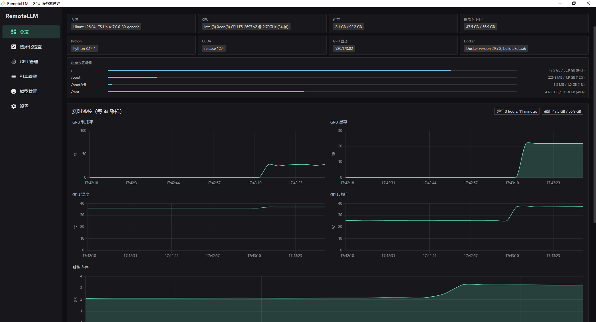
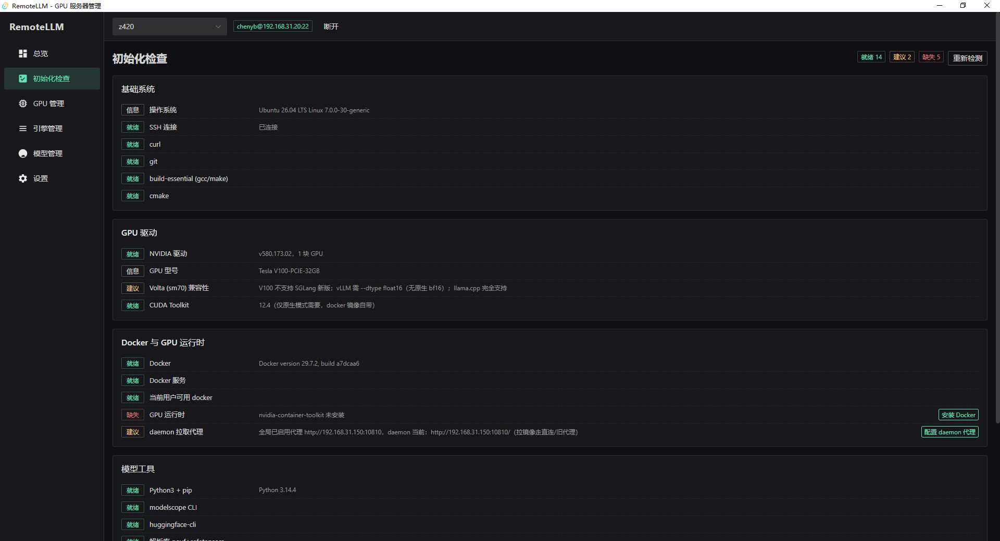
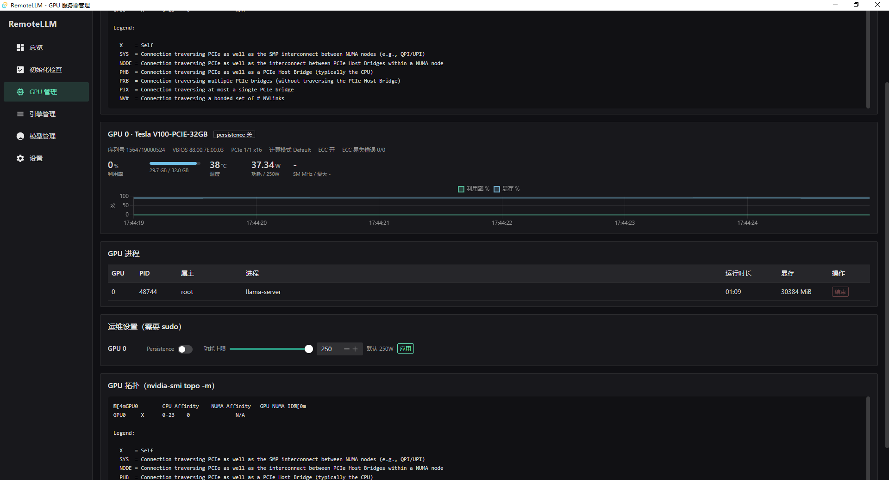
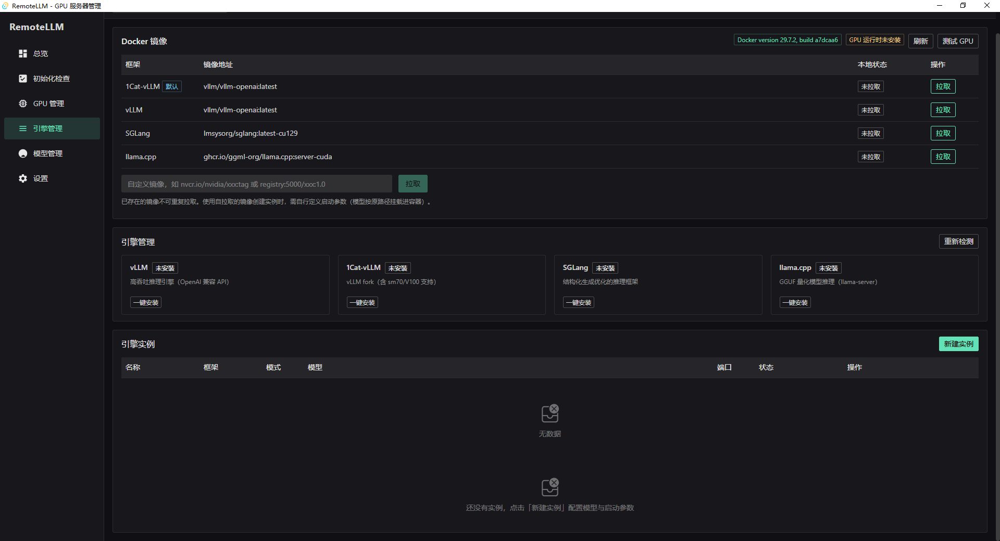
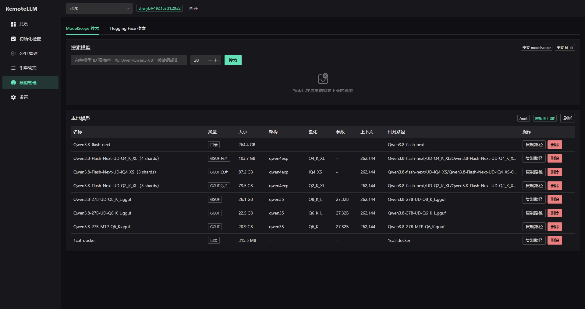
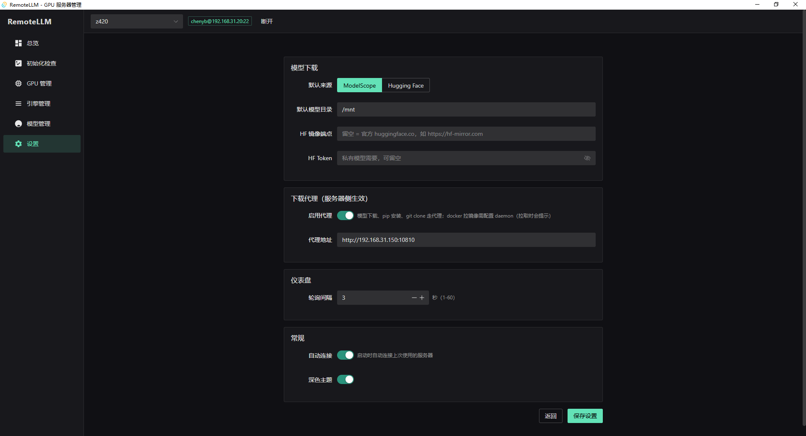

# RemoteLLM

基于 Rust + Tauri v2 的 Windows 桌面应用，通过 SSH 远程管理 GPU Linux 服务器上的 LLM 推理环境：从环境体检、驱动运维、推理框架部署，到模型下载、实例启停与实时监控，一站式完成，无需在服务器上手动敲命令。


## 界面总览

### 总览监控

环境信息卡片（系统 / CPU / 多分区磁盘 / Python / CUDA / 驱动 / Docker）；GPU 利用率、显存、温度、功耗实时曲线与 GPU 进程列表；推理服务 `/metrics` 指标抓取 + 折线图（自动勾选关键指标，支持手动勾选与自动刷新）。



### 环境检查

24 项体检（基础工具 / GPU 驱动 / Docker 与 GPU 运行时 / 模型工具 / 推理引擎 / CUDA 库），缺失项一键修复（pip / apt / Docker 安装授权 / 跳转拉取镜像）；V100 等 sm70 卡型兼容性提示；驱动等手动项提供复制命令。



### GPU 管理

每卡概览（型号 / 序列号 / VBIOS / PCIe / ECC / 降频原因，兼容新旧驱动位掩码格式）；GPU 进程管理（显示属主，仅可结束自己的进程）；Persistence Mode 开关与功耗上限调整（sudo 密码流）；GPU 拓扑展示。



### 框架管理

Docker 镜像一键添加 / 拉取，「添加框架镜像」支持任意仓库镜像（框架名 + 镜像地址，地址合法性校验后自动拉取并持久保存）；vLLM / 1Cat-vLLM / SGLang / llama.cpp 原生框架检测；实例参数动态表单 + 启动命令实时预览；运行日志抽屉（初始 500 行，滚动到顶自动加载更早内容）。



### 模型管理

ModelScope / Hugging Face 搜索与服务器端流式下载；本地模型扫描使用官方 `gguf` / `safetensors` 包解析头部（架构 / 参数量 / 上下文 / 量化，分片组聚合），带持久化解析缓存——目录未变化时刷新秒级返回。



### 设置

默认下载来源、模型目录、HF 镜像端点 + Token、轮询间隔、深色主题；下载代理（启用后模型下载 / pip / git clone 走代理，Docker 拉镜像自动配置 daemon）。



## 功能特性

- **服务器管理**：多服务器档案（密码 / 公钥认证），SSH 连接与断开，启动自动连接
- **总览**：环境信息卡片；GPU 利用率 / 显存 / 温度 / 功耗实时曲线、GPU 进程列表（pmon）；推理服务 `/metrics` 指标抓取 + 折线图（自动勾选关键指标 + 手动勾选、自动刷新）
- **环境检查**：24 项体检，一键修复（pip / apt sudo / Docker 安装授权 / 跳转拉取）；dpkg + pip 双通道检测 12 个 CUDA 库（cuBLAS / cuDNN / NCCL / TensorRT-LLM 等）；V100 等 sm70 卡型兼容性提示
- **GPU 管理**：每卡概览 + 迷你趋势图；GPU 进程管理（显示属主，仅可结束自己的进程）；Persistence Mode 开关、功耗上限调整（sudo 密码流）；GPU 拓扑展示
- **框架管理**：
  - Docker 镜像：内置四框架镜像一键添加；「添加框架镜像」支持任意仓库镜像（框架名 + 镜像地址，地址合法性校验，自动拉取并持久保存，可随时移除）
  - 原生框架检测：vLLM / 1Cat-vLLM / SGLang / llama.cpp 安装状态与版本，一键安装 / 升级 / 卸载
  - 新建实例按框架分流：内置四框架保留完整参数 Tab 分页设置（悬停查看 CLI 旗标与官方默认值）；自定义框架为简化表单，启动命令由用户自行填写
  - 实例启停：原生进程（nohup + PID）或 Docker 容器（`--gpus all`、模型路径原样挂载）；启动命令实时预览
  - 运行日志：初始加载最后 500 行，滚动到顶自动加载更早 500 行（视口锚定不跳动），抽屉宽度为窗口 2/3
- **模型管理**：ModelScope / Hugging Face 搜索，服务器端下载（流式日志）；本地模型扫描用官方 `gguf` / `safetensors` 包解析头部（架构 / 参数量 / 上下文 / 量化，分片组聚合）；持久化解析缓存（目录指纹未变化时刷新秒级返回，含重启应用后）；模型删除
- **设置**：默认下载来源、模型目录、HF 镜像端点 + Token、轮询间隔、深色主题；下载代理（启用后模型下载 / pip / git clone 走代理，Docker 拉镜像自动配置 daemon）
- **一键安装**：pip / git+cmake / docker pull 安装框架与工具链；1Cat-vLLM 仓库地址与镜像可在服务器档案中配置

## 快速上手

1. **安装**：从 [Releases](https://github.com/chenyb999-zhcn/RemoteLLM/releases/latest) 下载 `RemoteLLM_*_x64-setup.exe` 安装
2. **添加服务器**：填写主机、账号、认证方式（密码或私钥），连接
3. **环境体检**：环境检查页查看 24 项结果，缺失项一键修复
4. **准备框架**：Docker 镜像页添加 / 拉取镜像（可添加自定义框架镜像），或原生框架一键安装
5. **创建实例**：选框架、模型路径、参数（自定义框架直接填写启动命令）→ 启动
6. **监控运维**：总览页看 GPU 曲线与 `/metrics` 指标；日志抽屉查看实例输出

## 下载安装

- 下载地址：<https://github.com/chenyb999-zhcn/RemoteLLM/releases/latest>
- 平台：Windows 10 / 11 x64（NSIS 安装包 `RemoteLLM_<版本>_x64-setup.exe`）
- 依赖 WebView2 Runtime：Windows 11 自带；Windows 10 缺失时安装器会自动引导安装

## 远程目录约定

所有远端操作统一使用 `~/RemoteLLM/` 根目录（可在服务器档案中修改）：

```
~/RemoteLLM/
├── models/   # 模型权重
├── run/      # 实例 PID 文件
└── logs/     # 实例日志
```

## 技术栈

| 层 | 技术 |
|---|---|
| 前端 | Vue 3 + TypeScript + Naive UI + Pinia + Chart.js |
| 后端 | Rust + Tauri v2 |
| SSH | russh（密码 / 公钥认证） |
| 存储 | tauri-plugin-store（本机 JSON） |

## 开发与构建

```bash
npm install
npm run tauri dev              # 开发运行
npx vue-tsc --noEmit           # 前端类型检查
cargo test                     # Rust 测试（src-tauri/ 下执行）
npm run tauri build -- --bundles nsis   # 打包
# 产物: src-tauri/target/release/bundle/nsis/RemoteLLM_*_x64-setup.exe
```

## 注意事项

- **V100（sm70）用户**：官方 vLLM 新版已不支持 sm70，建议使用 1Cat-vLLM（vLLM fork，含 SM70 支持），默认镜像 `ghcr.io/chenyb999-zhcn/1cat-vllm:1.5`
- **sudo 操作**：走密码流，密码仅当次使用、不保存；服务器配置免密 sudo 或 root 登录则无感知
- **代理**：设置页启用下载代理后，模型下载 / pip / git clone 走代理；Docker 拉镜像时若 daemon 代理不一致会自动引导配置（重启 docker，运行中容器会中断）
- **凭据安全**：SSH 密码 / 私钥路径、HF Token 仅存储于本机应用数据目录（JSON），不上传任何服务器

## License

[Apache-2.0](LICENSE)
